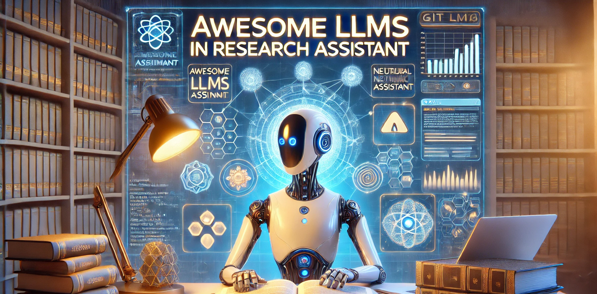

    <a href="README_zh.md">中文</a>&nbsp ｜ &nbspEnglish&nbsp

# 📚 Awesome LLMs in Research Assistant

With the powerful capabilities of LLMs in understanding and processing scientific documents, their application as research assistants has become increasingly promising. In this repo, we aim to provide **a comprehensive overview of the latest awesome works that leverage LLMs as research assistants**. We also include platforms, tutorials, and workshops to help you get started with your relevant projects.

Any contributions and discussions are welcome! 

 

---

## Contents

1. [Tasks](#1-tasks)
   - [Literature Review and Summarization](#11-literature-review-and-summarization)   
   - [Scientific Question Answering](#12-scientific-question-answering)   
   - [Data Analysis and Visualization](#13-data-analysis-and-visualization)  
   - [Writing Assistance](#14-writing-assistance)   
   - [Workflow Automation](#15-workflow-automation) 
   - [Peer-Review](#16-peer-review)
   - [Representation Learning](#17-representation-learning)
2. [Techniques](#2-techniques)
   - [Prompt Engineering](#21-prompt-engineering)   
   - [Fine-Tuning](#22-fine-tuning)   
   - [Zero-Shot and Few-Shot Learning](#23-zero-shot-and-few-shot-learning)  
   - [Single Agent](#24-single-agent)   
   - [Multi-Agent](#25-multi-agent)  
3. [Dataset](#3-dataset)  
4. [Evaluation](#4-evaluation)  
5. [Platforms](#5-platforms)  
   - [Personalized Recommendation](#51-personalized-recommendation)  
   - [PaperChat](#52-paperchat)    
   - [Writing Assistant](#53-writing-assistant)   
   - [Integrated](#54-Integrated)
6. [Workshops and Tutorials](#6-workshops-and-tutorials)  

---

## 1. Tasks

### 1.1 Literature Review and Summarization
- Automatically summarize academic papers.
- Generate concise literature reviews for specific research domains.

### 1.2 Scientific Question Answering
- Use LLMs for precise and context-aware question answering.
- Applications in FAQ generation and academic support.

### 1.3 Data Analysis and Visualization
- Leverage LLMs to interpret and visualize complex datasets.
- Automate the creation of charts and graphs for presentations.

### 1.4 Writing Assistance
- Help researchers write papers, proposals, and technical documents.
- Suggestions for grammar, style, and structure improvement.

### 1.5 Workflow Automation
- Automate repetitive research tasks such as data preprocessing.
- Enable seamless integration of multiple research tools.

### 1.6 Peer-Review
- Provide insights for peer-reviewing academic papers.
- Suggest improvements and detect errors in submissions.

### 1.7 Representation Learning
- Facilitate learning of data representations for downstream tasks.
- Applications in embedding-based search and clustering.

    <b><a href="#contents">👉 back to top</a></b>

## 2. Techniques

### 2.1 Prompt Engineering
- Design effective prompts to improve LLM performance.
- Case studies of prompt optimization strategies.

### 2.2 Fine-Tuning
- Fine-tune models for domain-specific tasks.
- Examples include scientific writing and mathematical problem solving.

### 2.3 Zero-Shot and Few-Shot Learning
- Explore applications where minimal labeled data is required.
- Case studies in cross-lingual and low-resource scenarios.

### 2.4 Single Agent
- Utilize a single LLM agent for specific research tasks.
- Examples include single-task optimization and focused outputs.

### 2.5 Multi-Agent
- Coordinate multiple LLM agents to solve complex problems.
- Applications in collaborative research and interdisciplinary tasks.

    <b><a href="#contents">👉 back to top</a></b>

## 3. Dataset

- **Self-Collected**: Guidelines for creating and curating custom datasets.
- **Aminer**: Overview of Aminer datasets for academic network analysis.

    <b><a href="#contents">👉 back to top</a></b>

## 4. Evaluation

- **Task-Oriented**: Evaluate models on specific research tasks (e.g., summarization, QA).
- **General Metrics**: Assess LLMs using metrics like BLEU, ROUGE, and F1-score.

    <b><a href="#contents">👉 back to top</a></b>

## 5. Platforms

### 5.1 Personalized Recommendation
- Tools for recommending personalized research materials.

### 5.2 PaperChat
- Interactive chat systems for exploring academic papers.

### 5.3 Writing Assistant
- Platforms that assist in writing academic content.

### 5.4 Integrated
- AI-powered tools for scholarly information retrieval.

    <b><a href="#contents">👉 back to top</a></b>

## 6. Workshops and Tutorials

### Scholarly Document Processing
- Tutorials on processing and analyzing scholarly documents.

### SDU@AAAI
- Workshops focusing on scholarly document understanding.

    <b><a href="#contents">👉 back to top</a></b>

---

## Contributions

We welcome contributions from the community! If you know of any useful tools, techniques, or resources related to LLMs as research assistants, feel free to submit a pull request, open an issue, or email (yongcao2018@gmail.com) to add links.

---